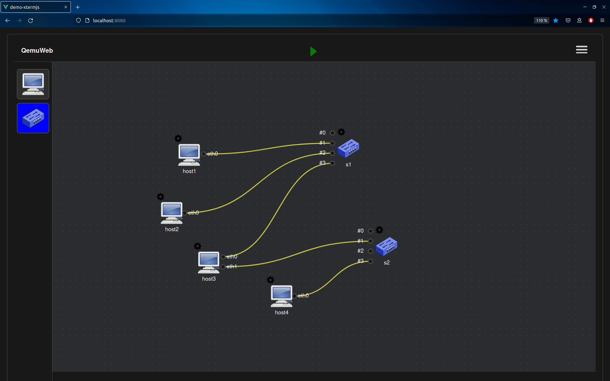

# QemuWeb

[QemuWeb](https://github.com/orel33/qemuweb) is a web application based on
[QemuNet](https://github.com/orel33/qemunet), that is a virtual network emulator
based on [Qemu](https://www.qemu.org/) for virtual machine and VDE for virtual
Ethernet switch.



## Installation

### Requirements

```bash
# install Node.js (version 10.13.0 or newer)
$ sudo apt install nodejs
# install NPM (version 6.14.17 or newer)
$ sudo apt install npm
# install Qemu
$ sudo apt install qemu-system-x86 qemu-utils vde2
# install other tools
$ sudo apt install firejail tmux screen
```

### Build App

```bash
# build app
$ cd qemuweb && npm install
$ cd frontend && npm install && npm run build
# run it (listening on default port 3000)
$ node app.js
```

Then open <http://localhost:3000> on your favorite browser.

## Usage

```
Usage: node app.js [options]
    -s, --secure         enable secure mode for http
    --sslkey <file>      path to SSL key (default: "./cert/key.pem")
    --sslcert <file>     path to SSL certificate (default: "./cert/server.crt")
    -p, --port <number>  listen port (default: 3000)
    -o, --openid         enable openid authentication
    -h, --help           display help for command
```

## Docker Demo

*todo*

## Credits

This application was initially written by [Guillaume
Bienfait](mailto:guillaume.bienfait@etu.u-bordeaux.fr) in July 2022 during an
internship at the University of Bordeaux (UF Info). It is currently maintained
by [Aurelien Esnard](mailto:aurelien.esnard@u-bordeaux.fr) and [Abdou
Guermouche](mailto:abdou.guermouche@u-bordeaux.fr).

Acknowledgements to [Christophe Delmon](mailto:christophe.delmon@u-bordeaux.fr) for the technical support at [CREMI](https://www.emi.u-bordeaux.fr).

---
<aurelien.esnard@u-bordeaux.fr>
