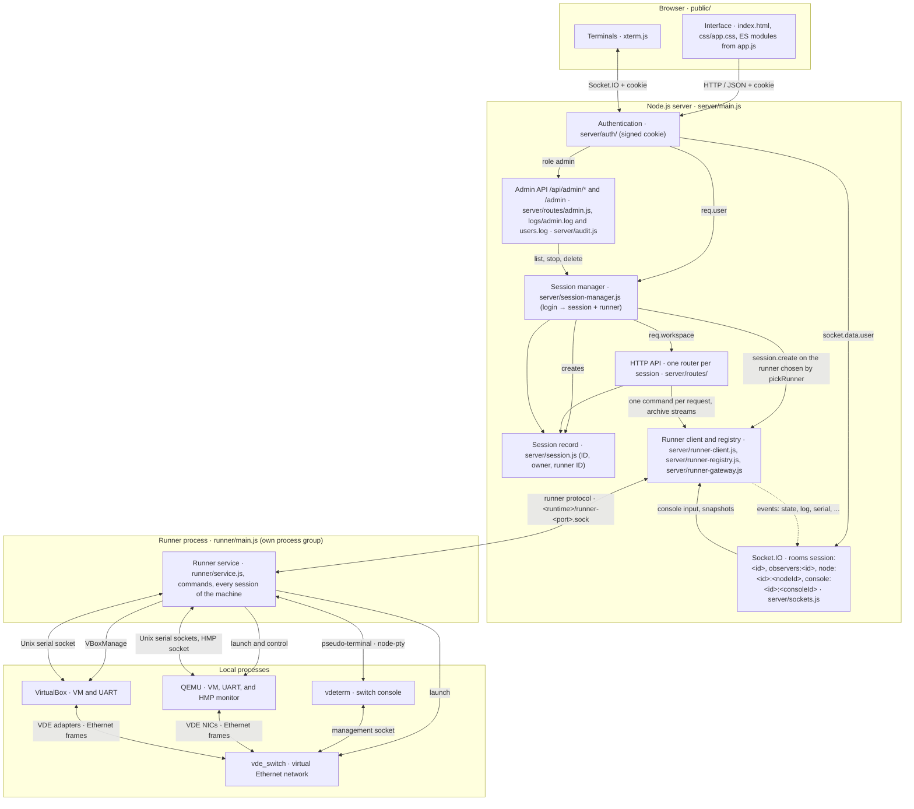

# QemuWeb architecture

QemuWeb separates the Web interface, the Node.js server (the control plane), and
the runner, a separate process that creates the machines. The browser
communicates with the server, which sends commands to the runner and relays the
consoles.

## Glossary

| Term | Meaning |
| --- | --- |
| Session | A user's workspace: its nodes, its engine (`qemu` or `vbox`), and its runtime directory `runtime/sessions/<id>/`. Each user owns exactly one session, with a random ID, recorded as `owner` in `meta.json` next to `session.json`. A session ZIP archive and `session.json` describe it; `meta.json` (owner, creation date) belongs to the live session only and is never exported. |
| User | A login from `users.json` (or the implicit `local` user when `--no-auth`), with the role `student` or `admin`. An admin owns a session like anyone else and may also supervise, observe and clean up the others. |
| Observer | An admin's browser tab or socket reading another user's session (`X-Observe` header, Socket.IO `auth.observe`): read-only, except console input after taking control of a node. |
| Node | An element of a session: a host or a switch. API routes and Socket.IO events use `nodeId`. |
| Host | A node that is a virtual machine (QEMU or VirtualBox). |
| Switch | A node that is a VDE switch. |


```mermaid
flowchart TB
  subgraph Browser["Browser · public/"]
    UI["Interface · index.html, css/app.css, ES modules from app.js"]
    Terminal["Terminals · xterm.js"]
  end

  subgraph Server["Node.js server · server/main.js"]
    Auth["Authentication · server/auth/ (signed cookie)"]
    Manager["Session manager · server/session-manager.js (login → session + runner)"]
    Routes["HTTP API · one router per session · server/routes/"]
    Sockets["Socket.IO · rooms session:&lt;id&gt;, observers:&lt;id&gt;, node:&lt;id&gt;:&lt;nodeId&gt;, console:&lt;id&gt;:&lt;consoleId&gt; · server/sockets.js"]
    Admin["Admin API /api/admin/* and /admin · server/routes/admin.js, logs/admin.log and users.log · server/audit.js"]
    Session["Session record · server/session.js (ID, owner, runner ID)"]
    Client["Runner client and registry · server/runner-client.js, server/runner-registry.js, server/runner-gateway.js"]
  end

  subgraph RunnerProcess["Runner process · runner/main.js (own process group)"]
    Runner["Runner service · runner/service.js, commands, every session of the machine"]
  end

  subgraph Local["Local processes"]
    QEMU["QEMU · VM, UART, and HMP monitor"]
    VBox["VirtualBox · VM and UART"]
    VDE["vde_switch · virtual Ethernet network"]
    VDeterm["vdeterm · switch console"]
  end

  UI -->|"HTTP / JSON + cookie"| Auth
  Terminal <-->|"Socket.IO + cookie"| Auth
  Auth -->|"req.user"| Manager
  Auth -->|"role admin"| Admin
  Admin -->|"list, stop, delete"| Manager
  Auth -->|"socket.data.user"| Sockets
  Manager -->|"req.workspace"| Routes
  Manager -->|"creates"| Session
  Manager -->|"session.create on the runner chosen by pickRunner"| Client
  Client <-->|"runner protocol · &lt;runtime&gt;/runner-&lt;port&gt;.sock"| Runner
  Routes --> Session
  Routes -->|"one command per request, archive streams"| Client
  Sockets -->|"console input, snapshots"| Client
  Client -.->|"events: state, log, serial, ..."| Sockets
  Manager --> Session
  Runner -->|"launch and control"| QEMU
  Runner -->|"VBoxManage"| VBox
  Runner -->|"launch"| VDE
  Runner <-->|"Unix serial sockets, HMP socket"| QEMU
  Runner <-->|"Unix serial socket"| VBox
  Runner <-->|"pseudo-terminal · node-pty"| VDeterm
  VDeterm <-->|"management socket"| VDE
  QEMU <-->|"VDE NICs · Ethernet frames"| VDE
  VBox <-->|"VDE adapters · Ethernet frames"| VDE
```

## Main paths

- **Host console:** xterm.js exchanges characters with `server/sockets.js` over
  Socket.IO. The runner relays them through a QEMU or VirtualBox Unix serial
  socket connected to the guest's `ttyS0`. A Debian host can have a second
  serial port (`ttyS1`, QEMU's second `-serial`, `serial1.sock`): see
  [Console IDs](#console-ids).
- **Switch console:** Socket.IO connects to `node-pty`, which runs `vdeterm`.
  It uses the `vde_switch` management socket. Guest Ethernet traffic uses a
  separate VDE data socket.
- **QEMU monitor:** the Monitor view sends HTTP commands to the server; the
  runner queries QEMU's HMP socket. This controls the emulator, not the guest shell.
- **Actions and status:** each HTTP request of a session becomes one command
  to the runner over the runner protocol (see [Runner interface](#runner-interface)).
  The runner reports state, logs and serial output as events, which
  `server/sockets.js` forwards over Socket.IO to the relevant browser tabs.
- **Users and sessions:** `server/auth/` checks the signed cookie of every request
  and of the Socket.IO handshake (Origin checks are planned for milestone 6).
  `server/session-manager.js` maps the login to its workspace `{session, runner}`,
  creating it at first use; it survives logouts and closed tabs until the user
  deletes it or the server stops. Each HTTP request goes to the router of the
  user's own session, whose runner looks a node ID up only there (404 otherwise).
  Per-session events go to the room `session:<id>`, per-node events (`state`,
  `log`, `logs-reset`) to `node:<id>:<nodeId>`, and console output (`serial`,
  `serial-reset`) to `console:<id>:<consoleId>`; a socket joins them only for a
  node of its own (or observed) session.
- **Administration:** `server/main.js` mounts, in this order after authentication,
  the observation gate (`X-Observe`: admins only, `GET`/`HEAD` only, the
  observed workspace taken with `manager.get`, never `open`), the
  `/api/admin` router (first middleware: role `admin`, then 403 on any path
  for others), `DELETE /api/session`, and the middleware that opens the
  caller's own session and records its activity. An admin call therefore never
  opens a session for the admin, and an observed session never gets an
  activity mark. An observer socket (`auth.observe`) joins the observed
  session's rooms and `observers:<id>`; `server/sockets.js` refuses its `input`,
  `clear-console` and `terminal-resize`, relays what the owner's page shows
  (`owner-view`, a [view state](#view-state) validated by `normalizeView`,
  published by that page whenever it changes, never derived from console
  sockets attaching; the last one is also sent to a new observer), sends `observe-unavailable` when the login has no session, and
  lets it type only while its admin controls the session (`take-control`
  from any of that admin's observer sockets, `server/console-control.js`: one lock
  per session, held by the admin's login, released explicitly, after 10
  minutes without input, on session deletion, or when that admin's last
  observer socket on the session closes; the owner's input is then dropped on
  every node). `console-control` {admin, active} goes to every socket of the
  session, owner and observers, on each change and at connection, and the
  pages derive their banners from it only. While an admin holds
  control, the view goes the other way: the admin's page publishes
  `controller-view` (same fields and validation, accepted only from that admin
  while they hold a lock on the session, kept for a page opening meanwhile) and
  the owner's pages show it, with their own `owner-view` paused, so the two
  never drive each other at once. One driver at a time also in the browser:
  when a page's view is driven by the other side (the owner's page under
  control, or an observer with Follow checked and no control held),
  `body[data-view-driven]` disables every control that changes the view state
  (class `view-control`: pane view menu, layout menu, switch consoles, paging,
  tab selection, pane node menus), for the mouse (CSS) and the
  keyboard (`observe.js`); the banners say who drives. Nothing is hidden for an
  observer: the page has the user's exact layout, and every write action (class
  `write-action`) is shown disabled (greyed, no mouse, `aria-disabled`, keyboard
  and programmatic clicks blocked by `observe.js`; the Monitor entry of the view
  menu too, and a followed `monitor` shows the console). Taking control forces
  Follow on and applies the owner's view first, then the admin's page drives;
  while control is held the Follow box is checked and disabled. Every privileged socket
  event re-reads the account, so a disabled or removed account loses its
  sockets. `server/sockets.js` also counts each user's connected browser tabs (the
  tab's session socket carries `auth.main`), shown as online/offline in
  `/admin`. Admin actions are appended to `logs/admin.log`, the audit log of
  administrator actions (`server/audit.js`).
- **User events:** `logs/users.log` receives logins and logouts from the
  `/auth` routes, session creation and deletion from the session manager
  events (`removed` carries who asked), and the owner's explicit node and
  archive actions from one middleware of the session router
  (`server/routes/index.js`, `userEvent`), written when the response is sent.
  `/admin` reads both logs from their end (`readLogTail`).


### Console IDs

A host has one console per serial port. The **console ID** of channel 0
(`ttyS0`) is the node ID itself, so that path is unchanged; the second port
(`ttyS1`) is `<nodeId>:1` (`common/console-id.js`: `baseNodeId`,
`consoleChannel`, `consoleId`). The ID is used by `select-node`, `input`,
`clear-console`, the `console.*` commands and the `nodeId` field of the
`serial` and `serial-reset` events of channel 1. Everything else (`state`,
`log`, node lists, views) keeps plain node IDs. `select-node` joins the node
room and the console room, and leaves those of the previous selection, so a
pane shows one console at a time; the browser's `console2` pane view selects
`<nodeId>:1`. Each channel has its own connection and 256 KiB replay buffer in
the runner (`serial`/`serialBuffer`, `serial1`/`serialBuffer1`); the startup
hook marker filter applies to channel 0 only.

The serial ports of a host are the `serialPorts` key of a system profile in
`config.json`, a list of port names: `systems.default` declares `["ttyS0"]`, and
`debian13-legacy` and `debian13-cloud` replace it on QEMU with `["ttyS0",
"ttyS1"]` through `serialPorts:qemu` (VirtualBox keeps `["ttyS0"]`; a profile
without a valid list is refused). The list drives the QEMU command line: the
runner adds one `-serial unix:<node dir>/serial0.sock,server=on,wait=off` for
`ttyS0` and one `serial1.sock` for `ttyS1`, in list order, so a port that is not
listed gets no `-serial` option. `common/console-id.js` holds the allowed names
(`PORTS`) and `validatePorts`: a list must start with `ttyS0` and be a
contiguous prefix of `PORTS` (QEMU numbers `-serial` devices in order, and
`ttyS0` is the kernel console), and a host's list must also be a prefix of its
system's list. The channel index of a port is its position in the list. A host
overrides the list in `host.json` `config` (sparse, stored only when it differs
from the profile) and in its launch settings. A system without a getty on
`ttyS1` (an older image) shows an empty second console. `state` events,
`nodes-changed` and `GET /api/nodes` carry `serialPorts` (the running VM's
list while it runs), and changing it is a pending restart. The browser labels a
host's console views `Console (ttyS0)` and `Console (ttyS1)`; a switch keeps
`Console`.

## View state

What a page of the workspace shows is one plain JSON object, the view state,
defined, validated and compared in one module, `public/view-state.js` (a
classic script shared by the server and the browser: `paneCount`,
`normalizeView(raw, nodeIds)`, `sameView`):

```text
{ mode:     'terminals' | 'graphic',
  layout:   'single' | 'columns-2' | 'rows-2' | 'grid-4',
  panes:    (nodeId | null)[],   exactly paneCount(layout) entries: the node shown in each
                                 pane, in pane order; null = empty pane
  views:    ('console' | 'console2' | 'monitor' | 'log')[],
                                 parallel to panes: the view of each pane
                                 (Console ttyS0, Console ttyS1, Monitor, Log)
  switches: boolean,             switch consoles shown
  active:   nodeId | null }      the selected node (tab or graphic selection)
```

`normalizeView` returns a valid view state or null: known keys only (others
dropped), known layouts and modes, `panes` and `views` of the right length (a view state without `views` is
invalid), `views` entries among the four views, `panes` with strings or
null; node IDs not in the given list become null, and a node shown in two panes is kept in the first one; the view of a pane left
empty becomes `console`. The console page is not part
of the view: paging only decides which nodes are assigned to the panes, and
the resulting `panes` is what is published.

In the browser, `captureView()` reads the view and `applyView(view)` shows one
(layout, switch consoles, the panes' nodes through the same
assignment as the pane node menu, active node, mode), without saving it and
attaching only the consoles of panes whose node changes; then each pane's view
(`setPaneView`), only if its node allows it (Monitor needs a QEMU host, ttyS1 a
second console, else `console`; an observer is never shown the Monitor, a
followed `monitor` shows the console). `viewChanged()`, at
the end of `setPaneSessions` (so `showPage`), `focusPane` and
`setGraphicView`, publishes the view (deduplicated with `sameView`) and saves
it as `{view, graphicZoom}` in the browser; applying a received view does
neither. The owner's page publishes `owner-view`, except while an admin
controls its session; the controlling admin's page publishes
`controller-view`. A page follows a received view by `normalizeView` against
its own nodes, then `applyView`; a node it does not know yet makes it reload
its node list first. The saved view is restored the same way once the node
list is loaded.

## Module map

The server is split into layers with one-way dependencies:

- **`runner/`** is the runner: a separate process (`runner/main.js`) that
  executes every session of the machine. It depends only on `common/`, Node
  built-ins and `node-pty`, and the control plane never requires it: they
  talk through the runner protocol (see [Runner interface](#runner-interface)).
  `runner/service.js` holds the sessions and dispatches the commands of
  `runner/commands/`; each session has its own runtime
  (`runner/session-runner.js`): a context (no module-level state), modules
  created as factories (`createCatalog(ctx)`, ...) in dependency order, and a
  resource sampling timer.
- **`server/`** is the control plane: `session-manager.js` (one session per user,
  bound to a runner), `runner-client.js`, `runner-registry.js`
  and `runner-gateway.js` (the runners and their connections), `server-instance.js`
  (server records used by the scripts) and `auth/` (authentication).
- **`server/routes/`** and **`server/sockets.js`** form the web layer: HTTP routes by area and
  Socket.IO wiring. `server/main.js` only starts (arguments and checks) and `server/serve.js` wires everything.
- **`common/`** holds code shared by the runner and the server, including the
  protocol framing.

| Module | Role |
| --- | --- |
| `server/main.js` | Entry point: command line (`common/cli.js`, table in `server/options.js`), banner, `Options`, `Checking dependencies…`, then `server/startup-checks.js` (`Checking configuration…`: `config.json`, users file, log and runtime directories); the web stack is loaded only after these pass, so `--help` and a refused option answer at once. |
| `server/serve.js` | Wiring of the web stack: runner gateway, HTTP server (opened at once; a runner connects at any time), Socket.IO, authentication, session manager and routes. |
| `server/options.js` | The server's command line: `--listen <port>` (default 3002) and `--runtime <dir>` (default `runtime/`), anything else refused with exit status 2. |
| `server/sockets.js` | Forwards each runner's events to the rooms of its session, relays console input, and handles observer sockets and console control. |
| `server/routes/admin-runners.js` | `GET /api/admin/runners`: the runners and their warnings, read-only (the Runners section of `/admin`, `public/admin-runners.js`). |
| `server/routes/admin.js` | `/admin` page, `/api/admin/*` (sessions with metrics, stop-all, delete, bulk delete, accounts), the `X-Observe` observation gate. |
| `server/routes/index.js` | Builds the router of one session from the route modules, and `handle(command, args, status)`: a route that sends one runner command. |
| `server/routes/settings.js` | General settings, system catalog and startup CD-ROM capability. |
| `server/routes/nodes.js` | Node listing, switches, start, stop, Resume all, Stop all, reboot, reset, monitor, rename and deletion. |
| `server/routes/hosts.js` | Host creation, configuration and startup CD-ROM. |
| `server/routes/topology.js` | Topology (`.topo`) preview, creation and export. |
| `server/routes/archives.js` | Session ZIP size estimate, export, base image check and import; the ZIP goes between the browser and the runner as a protocol stream. |
| `server/routes/metrics.js` | Per-host CPU and memory metrics. |
| `server/session-manager.js` | Login → `{session, runner}`; creation at first use on `registry.pickRunner`, deletion, dropping the sessions of a lost runner, resynchronisation on a runner's `hello`, `runtime/users/<login>` links. |
| `server/session.js` | The control plane's record of a session: ID, owner, creation date, runner ID, last activity (memory only) and archive lock. |
| `server/runner-client.js` | One runner connection: requests and responses, per-session handles (`request`, `input`, `events`, streams), `hello`. |
| `server/runner-registry.js` | Runners with their state (`starting`, `online`, `lost`), capabilities and client; `pickRunner(login)`. |
| `server/runner-gateway.js` | The runner socket `<runtime>/runner-<port>.sock`: stale-socket check, mode 0600, one runner at a time, registered as the trusted `local`; a second connection is closed. |
| `server/server-instance.js` | `<runtime>/server-<port>.pid` and `.session` records (read by `scripts/stop.sh`), pruning of empty sessions left by stopped servers (when a runner sharing `runtime/` connects). |
| `server/auth/` | `index.js` facade (login routes, middleware, `requireAdmin`, Socket.IO handshake, `currentUser`), `users-store.js` (`users.json` and the account operations shared by `scripts/user.js` and the admin API), `passwords.js` (scrypt), `cookie.js` (signed cookie). |
| `server/audit.js` | Log directory (`logs/` or `--logs`), `admin.log` (audit log of administrator actions) and `users.log` (user events), JSON lines, and reading their last entries. |
| `server/console-control.js` | Exclusive per-session control lock (held by an admin's login) with its 10-minute idle timer. |
| `runner/main.js` | Runner process entry point, same startup sequence as the server: command line (`common/cli.js`, table in `runner/options.js`: `--port` or `--connect`, `--runtime`, `--config`, `--exit-on-disconnect`), banner, `Options`, preflight, its own configuration checks, connection and its state lines. |
| `runner/index.js` | Runner facade: `createRunnerService`, `serveConnection`, `resolveCommands`. |
| `runner/service.js` | Every session of the runner: `session.create`/`session.delete`, command dispatch (404 for an unknown session or node), console input, `hello` with the capabilities, `runtimeRoot` and the sessions (ID, owner, creation date), shutdown. |
| `runner/endpoint.js` | The runner side of a connection: requests in arrival order, events, console output coalescing and backpressure. |
| `runner/commands/` | Commands by area (nodes, hosts, settings, topology, archives, consoles); their results are the JSON bodies of the HTTP API. |
| `runner/session.js` | One session as the runner holds it: engine, nodes, runtime directory, `session.json` (definition), `meta.json` (owner, creation date). |
| `runner/session-runner.js` | The runtime of one session; `stopAllNodes` stops every host then every switch and keeps the nodes; `startAllNodes` starts every stopped switch then every stopped host (Resume all and the automatic start of a loaded session); both skip nodes with an action in progress. |
| `runner/context.js` | Per-session context: session, commands, paths, `hostNodes()` of every session of the runner, console flow, events. |
| `runner/archive-snapshot.js`, `runner/archive-zip.js` | What a session ZIP contains, and the ZIP format itself. |
| `runner/session-runtime.js` | Node records, runtime directories, hostname aliases, state and log publishing. |
| `runner/node-lifecycle.js` | Host start, stop, reboot, reset and deletion. |
| `runner/catalog.js`, `runner/host-config.js` | System catalog and `host.json`. |
| `runner/launch-preview.js` | Settings, storage paths and commands a host would use, without starting it. |
| `runner/engines/` | QEMU, QEMU monitor (HMP), VirtualBox, child process exit. |
| `runner/network/` | NIC MAC and port assignment; VDE switch and its `vdeterm` terminal. |
| `runner/console/` | Guest serial consoles (one per channel) and startup hook marker filtering. |
| `common/console-id.js` | Console IDs (node ID, `:1` for the second serial port); also served to the browser at `/console-id.js`. |
| `runner/media/` | Working disks, startup ISO, startup files and base image hashes. |
| `runner/preflight.js`, `runner/resources.js`, `runner/metrics.js` | Executable checks; CPU and memory sampling. |
| `common/` | Runner protocol framing (`runner-protocol.js`), `.topo` parsing (`topology.js`), IDs, launch settings, `config.json` validation, JSON writes, shell quoting. |

### Web interface

`public/index.html` contains only the page structure. `public/css/app.css`
holds the styles. The script is split into native ES modules (no framework or
bundler) loaded from `public/app.js`, which runs their initialization in a fixed
order. State that several modules reassign lives on the `store` object of
`state.js`. `monitor-terminal.js`, `session-log.js`, `network-node-icons.js`, `view-state.js` and
`topology-graphic.js` remain classic scripts, also loaded by unit tests.
`login.html` and its module `login.js` form the separate login page;
`admin.html` and `admin.js` the supervision page `/admin`, served to admins only.

| Module | Role |
| --- | --- |
| `app.js` | Entry point: initializes the other modules. |
| `account.js` | User name, Supervision link (admins), Delete session and Log out in the header; authentication-disabled warning. |
| `state.js` | Nodes, shared state, view and general settings in `localStorage`. |
| `api.js` | HTTP helpers: node URLs, JSON requests, launch preview URL, redirect to the login page on 401, `X-Observe` header in an observation tab. |
| `socket.js` | Per-pane console sockets and the shared notification socket. |
| `terminal.js` | Console panes, menus, font size and Console (ttyS0)/Console (ttyS1)/Monitor/Log views. |
| `host-console-settings.js` | Console tab of Host Settings: read-only console (`serial0.sock`, `serial1.sock`) and monitor sockets. |
| `workspace.js` | Pane layout, paging, node tabs, state badges and metrics. |
| `nodes.js` | Node model, server synchronization and lifecycle actions. |
| `node-dialogs.js` | Add switch and Clone dialogs. |
| `host-settings.js` | Host Settings dialog, also used to add a host. |
| `startup-media.js` | Startup tab: `start.sh` template, startup disk and extra files. |
| `general-settings.js` | General Settings dialog. |
| `topology.js` | Graphic network view and `.topo` load/save. |
| `archive.js` | Session ZIP save and load dialogs. |
| `observe.js` | Observation tab (`/?observe=<login>`): target, socket options, banner and navigation, console control on both sides, following received view states. |
| `view-state.js` | Classic script, also required by `server/sockets.js`: the view state (`paneCount`, `normalizeView`, `sameView`). |

## Images and the session

[`config.json`](../config.json) defines system profiles and base image paths.
`scripts/prepare.sh` downloads and prepares those images in `images/`: RAW for
QEMU and VDI for VirtualBox. At runtime, each host gets its own working disk
under `runtime/sessions/<id>/` without changing the base image. QEMU uses a QCOW2
disk backed by RAW; VirtualBox uses a differential VDI. `session.json`,
`host.json`, `switch.json`, startup scripts, and sockets also live in `runtime/`.
`runtime/users/<login>` links to the user's session directory. The session ID
stays random and never contains the login, which keeps socket paths short and
logins out of archives.

Stopping a host keeps its working disk for a later start. Resetting recreates
the disk from the base image. Removing a node or stopping the server cleans
up its temporary files. A ZIP export can preserve a session explicitly; a
`.topo` file describes only hosts, switches, and their connections.

## Runner interface

The runner executes sessions; the control plane (web server) never touches a
node process, a node record or a runtime file. They talk through one
connection carrying a small message protocol, the same for the local runner
(a separate process on a Unix socket) and for remote runners (WebSocket over
TLS, milestone 5c). Unit tests run the same protocol over an in-memory stream
pair (`test/unit/runner-pair.js`).

### Ownership

| Data | Owner |
| --- | --- |
| Node records (configuration, runtime state, run log, serial buffer, disks, startup files, launch settings, NIC assignment) | Runner (source of truth) |
| `runtime/sessions/<id>/`: `session.json`, `meta.json`, `host.json`, `switch.json`, `startup/`, working disks, sockets, hostname aliases | Runner |
| Session engine (`qemu`/`vbox`) | Runner (in `session.json`) |
| System catalog (`config.json`), executables, `/dev/kvm`, resource sampling | Runner |
| Login → session ID, owner, creation date, last activity, archive lock, HTTP routers, Socket.IO rooms, console control, view states, audit logs | Control plane |
| `runtime/users/<login>` alias, `runtime/server-<port>.*` records | Control plane (local filesystem only) |

The control plane keeps no copy of node records. Everything that reads or
changes a node (validation of a host configuration, topology loading, archive
installation, start/stop ordering) runs in the runner, as one command. A route
of `server/routes/` becomes: parse the HTTP request, send one command, map the result
or the error to the HTTP response. The runner's answers are exactly the JSON
bodies the routes return today.

### Transport and framing

One bidirectional byte stream: a Unix stream socket for the local runner. The
control plane listens on `runtime/runner-<port>.sock` (mode 0600) and the
runner connects to it, the same direction as a remote runner dialling out in
5c. Frames are length-prefixed:

```text
uint32 BE  length of what follows (1 + payload), at most 16 MiB
uint8      type: 0x4a 'J' = JSON message (UTF-8), 0x42 'B' = binary stream chunk
payload    J: one JSON object
           B: uint32 BE stream ID, then raw bytes (at most 1 MiB)
```

Length prefixes instead of newline-delimited JSON, because archives carry
binary data (QCOW2 disks up to 64 GiB): base64 in JSON would cost a third
more and a JSON parse per chunk. Each frame maps one-to-one to a WebSocket
text or binary message, so 5c changes the transport, not the protocol. No new
dependency: the codec is about 60 lines over `net`.

Console data stays JSON text: the runner already decodes serial and `vdeterm`
output as UTF-8 (`StringDecoder`), and browsers receive strings.

### Messages

```text
hello     runner -> CP, first message of every connection
          {type:'hello', protocol:1, pid, engines:['qemu'|'vbox'...], kvm,
           cpus, memoryBytes, images:{<system>:{raw?, vdi?}} (each {size, sha256|null}),
           warnings:[<sentence>...] (config.json against this machine, max 20),
           runtimeRoot (the runner's runtime directory),
           sessions:[{sessionId, engine, owner, createdAt, nodes:[<listNodes entry>...]}]}
request   CP -> runner  {type:'request', id, command, sessionId?, args}
response  runner -> CP  {type:'response', id, result}
                        {type:'response', id, error:{message, status?}}
event     runner -> CP  {type:'event', sessionId, event, payload}
input     CP -> runner  {type:'input', sessionId, nodeId, data}   no response
stream    either way    {type:'stream', id, op:'end'|'error'|'credit', message?, bytes?}
```

- `id` is a positive integer chosen by the sender of the request, unique on the
  connection; responses may arrive in any order. A request pending when the
  connection closes fails with "Runner connection lost.".
- `error.message` is the user-facing message the API returns today; `status`
  is the HTTP status when the runner decided it (unknown node 404, busy or
  non-empty session 409, start error 400/500); otherwise the route's default
  status applies.
- Every per-session command and event carries `sessionId`: one runner process
  serves every session of the machine (resource rules such as "no
  VirtualBox next to QEMU/KVM" and the 5c capacity limits span sessions).
- `input` (console keystrokes, at most 4096 characters, already checked by
  `server/sockets.js`) has no response, to keep typing latency at one write. Messages
  on one connection are handled in order, so input, resize and clear keep
  their order, and so do the events of a node.

### Commands

Session: `session.create {sessionId, owner, createdAt}` (directory,
`session.json`, `meta.json`), `session.delete` (destroy every node, remove the
directory), `session.settings` / `session.setEngine {engine}`,
`session.summary` (counts, running nodes, reserved RAM and CPU, for `/admin`),
`runner.shutdown` (every session, used at server stop).

Nodes (args mirror the HTTP bodies and queries): `nodes.list`,
`nodes.metrics`, `nodes.stopAll`, `nodes.startAll`, `nodes.deleteAll`,
`node.preview`, `node.start {nodeId, engine?, imageId?}`, `node.stop`,
`node.reboot`, `node.reset`, `node.monitor {command}`, `node.rename {name}`,
`node.delete`, `switch.create {id, name, autostart}`, `host.create {...}`,
`host.config` / `host.configure {...}`, `host.guestMedia` /
`host.setGuestMedia`, `host.buildGuestCdrom`, `host.attachGuestCdrom`.

Catalog and files: `catalog.systems`, `topology.preview {text, engine}`,
`topology.load {text, engine, autostart, closePrevious}`, `topology.export`,
`archive.estimate {includeDisks}`, `archive.check {engine, baseImages}`,
`archive.export {includeDisks}` (result `{stream, size}`, then the ZIP on that
stream), `archive.import {stream, query, contentType, declaredBytes}`
(the CP sends the uploaded ZIP on that stream as it arrives, with the HTTP
query options, type and declared size; the result is the import response).
Commands whose HTTP route takes a JSON body receive it as `body`
(`host.create`, `host.configure`, `session.setEngine`, `topology.*`, ...).

Consoles (`nodeId` of the console commands is a [console ID](#console-ids)):
`console.attach {nodeId}` (the `node-snapshot` content: state, logs, serial
buffer of that console), `console.resize {nodeId, cols, rows}`, `console.clear {nodeId,
line, column}`, and `input` messages.

### Events

`state`, `log`, `logs-reset`, `serial`, `serial-reset`, `nodes-removed`,
`nodes-changed`, `node-renamed` and `general-settings-changed`, with today's
Socket.IO payloads; `server/sockets.js` forwards them to the rooms of `sessionId`
(the last three were emitted by routes, they now come from the runner like the
others).

### Streams and backpressure

Archive transfers use binary frames on a stream ID allocated by the sender of
the request (`archive.import`) or by the runner (`archive.export`). Credit
flow control: a sender keeps at most 4 MiB unacknowledged per stream, the
receiver returns `credit` messages as it writes the bytes to disk or to the
HTTP response; `end` closes the stream, `error` aborts it, and so does the
connection loss. A receiver that gives up sends `cancel`: the sender's stream
ends with that error and no answer; late frames for a finished stream are
ignored, and no stream ever raises an unhandled `error` event. A transfer therefore never buffers more than 4 MiB in memory,
whatever the archive size.

Console output is coalesced per node and flushed once per event-loop turn. If
the connection's write buffer exceeds 8 MiB (a guest flooding its console),
the runner pauses the serial sockets and `vdeterm` terminals until the buffer
drains: the guest blocks on its UART instead of growing the server's memory.
Order is kept since nothing is dropped.

### Runners in the control plane

`server/runner-registry.js` holds every runner the control plane knows, each
with its own client (`server/runner-client.js`, one instance per connection,
never a global): `id`, `state` (`starting`, `online`, `lost`), the
capabilities from `hello` (engines, images, capacity, warnings), its
`runtimeRoot`, `trusted` and `ownerLogin` (null for a shared runner; reserved for
a runner owned by one student, unused). It holds one entry, `local`: the
runner of this machine, which dialled the gateway. `trusted` is set only
for that entry; a `hello` is untrusted input, so later runners (5c) will not
be trusted by default.

The session manager binds each session ID to a runner ID. The control plane
assigns session IDs (the runner never invents one) and chooses the runner in
one place, `pickRunner(login)`, called once when a session is created; it
returns the local runner until placement arrives in 5c. Resource rules that
span sessions (QEMU/KVM next to VirtualBox, metrics, later capacity) are
evaluated by each runner over its own sessions.

### Connection lifecycle

A runner always dials the server; the server never connects out, and never
starts or supervises a runner. A runner is a process of its own, started by
`./scripts/runner.sh` (`runner/main.js --port PORT`): by `./scripts/start.sh`,
which runs the server and a runner as two commands (development, tests, demo),
by hand, or as a systemd service. The server only listens; a runner dials in at
any time, and the server serves browsers without waiting for it. Session
routes answer 503 until one is online.

1. The server (`server/runner-gateway.js`) listens on `runtime/runner-<port>.sock`
   (mode 0600). It accepts one connection when no runner is registered or the
   registered one is lost, and closes any other at once.
2. The runner resolves its executables (`runner/preflight.js`), prints its
   configuration warnings, connects and sends `hello`. A runner that cannot
   start (an executable missing) prints its message and exits.
3. On `hello`, the control plane resynchronises (`SessionManager.resync`): a
   session bound to that runner but absent from `hello` is dropped (as below).
   A session reported by the runner that the control plane does not know is
   **adopted** when the runner is trusted (the local slot), its `sessionId`
   matches the ID pattern, its `owner` is a valid login and that owner has no
   workspace yet: the server creates the workspace for the owner (same path as
   opening a session: router, sockets, `session-adopted` in `users.log`).
   Otherwise (another session for the same owner, an invalid owner or ID, an
   untrusted runner) it is deleted with `session.delete`. The browsers log in
   again after a server restart and `select-node` re-attaches their consoles;
   the `lastActivity` of an adopted session is unknown, so it counts from its
   creation date. Untrusted runners (5c) never choose an owner: adoption is
   gated by `entry.trusted`.
4. Server stop (SIGINT, SIGTERM, `./scripts/stop.sh`): the server only closes
   the socket and exits; it removes the socket. What happens to the machines
   is the runner's choice (next point). `scripts/start.sh` stops its runner
   first (SIGTERM: the runner destroys every node of every session and removes
   `runtime/sessions/<id>/`), kills what is left of its process group, then
   stops the server.
5. `--exit-on-disconnect` is a choice of whoever starts the runner, not part
   of the protocol. `scripts/start.sh` uses it: the loss of the control
   connection is then the end of the runner's life (it destroys every node,
   removes its session directories and exits), so a server killed with
   SIGKILL leaves no VM behind. A runner started without it (the systemd
   service) keeps its VMs, retries every 2 s and resynchronises with `hello`
   (adoption above). Its console shows "Waiting for the server", "Connected",
   "The server refused the connection" (a runner is already connected) and
   "Connection to the server lost".
6. The server touches the runner's filesystem only when they share
   `runtime/`, that is when `hello.runtimeRoot` equals the server's
   `runtime/`: it then runs `pruneEmptyRuntimeSessions` when the runner
   connects (sparing the sessions of that `hello` and those of other live
   servers), creates the `runtime/users/<login>` aliases, and removes the
   session directories of a lost runner.

**Process groups in `scripts/start.sh`.** The script starts the server and the
runner each with `setsid`, so a terminal Ctrl+C reaches the script only. When the
runner ends for any reason, including SIGKILL, the script sends SIGKILL to
what is left of its group (QEMU, `vde_switch`) and stops the server. On Ctrl+C
or SIGTERM it stops the runner (bounded wait), then its group, then the server,
and exits 0; when the server or the runner dies by itself it exits with its
status. It never restarts anything: restarts are systemd's job
(`docs/deployment.md`).

**Runner loss.** The server never exits because a runner died. When a
runner's connection drops or its process exits, the registry marks it `lost`:

1. the control plane drops every session bound to it like a deleted session
   (users.log `session-deleted` with the reason `runner lost`; browsers get
   `session-deleted` and reload into a new, empty session): the VMs died with
   the runner, so there is nothing to keep. When the runner shared `runtime/`,
   the server removes the runtime directories of those sessions;
2. nothing restarts the runner. Under `scripts/start.sh` the script kills the
   runner's process group (QEMU and `vde_switch` are in it; `vdeterm` ends with
   its pseudo-terminal) and stops the server; in a deployment systemd restarts
   the runner service. Requests reaching a session while no runner is online
   answer 503.

In manual mode the sessions are dropped the same way, but nothing is killed or
respawned: the runner is the user's to restart, and machines of a dead runner
may stay in its process group (`scripts/killall.sh` stops them).

VirtualBox VMs run under VBoxSVC, outside the process group: after a runner
crash they stay registered, as after a server crash today.

### User-land runners

A runner is an ordinary unprivileged process, never root, possibly on a
student's lab machine (roadmap, milestone 5, "Mode utilisateur").

- It assumes no root, no capability, no dedicated system account, and writes
  nothing to `/etc` or `/var`. Every path is a parameter of `runner/main.js`:
  `--connect <socket>` (control connection), `--runtime <dir>` (sessions,
  default the project's `runtime/`, shared with the server), `--config <file>` (system catalog,
  default the project's `config.json`). `--port PORT` is `--connect <this
  project>/runtime/runner-<n>.sock`. `scripts/runner.sh` gets `--runtime runtime/`, so the files on disk do not change.
  The 5c configuration (`~/.config/qemuweb-runner/config.toml`, systemd
  `--user` unit) is out of scope here.
- The control socket is created by the control plane with mode 0600 in
  `runtime/`, a directory the same user owns.
- QEMU and VDE run unprivileged; only `/dev/kvm` needs the `kvm` group. The
  runner announces what it can do in `hello` instead of failing late:
  `engines` (QEMU needs its emulator and disk tool, VirtualBox `VBoxManage`;
  a runner may have only one), `kvm` (true when `/dev/kvm` is readable and writable),
  `cpus`, `memoryBytes`, and `images` (per system of its catalog: the RAW
  and VDI images present, with size and SHA-256 when known from
  `<image>.sha256` or the cache, never computed at connection time), and
  `warnings`: sentences from `runner/config-warnings.js` about `config.json`
  on this machine (a system whose base image is missing, default memory or
  processors above what the machine has). The runner prints them itself at
  startup, under "Checking configuration…", with a warning icon (with a `[runner]`
  prefix under `scripts/start.sh`); the registry keeps them in the runner's
  capabilities and `/admin` shows them. Starting a host adds a `# Warning:`
  line to its Log when the hosts of the runner would reserve more than 90 % of
  the RAM (`memoryWarning`, never blocking).
- Nothing in the protocol relies on a shared user, uid or filesystem: paths
  never cross the connection as data the other side opens (archives travel as
  streams, the launch preview shows paths for display only), and a session
  is named by its ID only.

### Multiple runners and untrusted runners

The 5a/5b choices hold for N runners: one client per runner, sessions bound
to a runner, `pickRunner` as the single placement point, per-runner
accounting. A runner on a student's own machine (owned by that student) flips
the trust model of the local runner: the control plane must not trust it.

- Everything from a runner is checked: an event or a response is accepted
  only for a session ID bound to that runner, frames and payloads have size
  limits, and payloads are validated before they reach a browser (console data
  is untrusted text, as it already is for guests).
- A runner provides no identity or authorization: logins, roles, console
  control and audit stay in the control plane, and a runner only ever receives
  commands for its own sessions.
- Later (5c/6, no code now): runner tokens bound to a user (`ownerLogin`),
  placement restricted to the owner's runners, quotas enforced by the control
  plane as well as by the runner, and archive streams size-limited on both
  sides.

### Testing

- Unit: the frame codec (split and merged chunks, size limits, binary
  frames), the client (request/response matching, errors with status,
  connection loss failing pending requests, events), the dispatcher (unknown
  command, unknown session or node), stream credit; client and dispatcher
  connected through an in-memory duplex pair, no process. The existing runner
  unit tests drive the runner service directly.
- Boundaries: `runner/` requires only `runner/`, `common/`, built-ins and
  `node-pty`; the control plane reaches the runner only through the client
  (`server/runner-client.js`) and never requires `runner/`.
- Integration: every scenario starts QemuWeb through `scripts/start.sh`, the real
  launch sequence. `check-runner` (VDE only) checks that sequence: the server and
  runner processes under `start.sh`, a switch session through it, the effect of
  SIGKILL on the runner, and that no `vde_switch`/`qemu-system` process nor
  `runtime/sessions/<id>` remains after a stop.
  `check-runner-manual` runs the server alone (`node server/main.js`): a runner started
  by hand survives a SIGKILL of the server, reconnects to a new one and its session is
  adopted.
